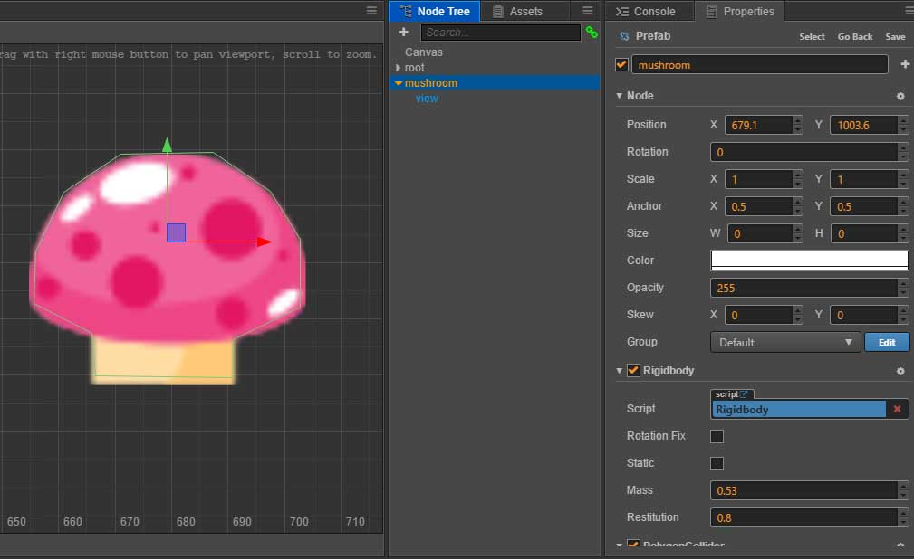

# cocos-creator-physics
Cocos Creator Physics Plugins

Components to add basic physics to Cocos Creator, using Matter.js

### Install
##### Cocos Creator

Setup

1. Download and install 
[matter-js](https://github.com/liabru/matter-js/releases/tag/0.10.0) and [poly-decomp.js](https://github.com/schteppe/poly-decomp.js)

2. Download and copy into your Cocos Creator project 
[MatterWorld.js](components/MatterWorld.js) and [Rigidbody.js](components/Rigidbody.js) 

3. Add a MatterWorld component to your root

4. Add a Rigidbody component to yours objects with collider.

##### Example 
Basic rectangle, circular and custom shapes colliders example [link](https://github.com/mjnf/cocos-creator-physics)

### Demo
[Open](http://staging.inmoove.com/cocos-creator-physics/)

### About

The library is a manual port of the Js library [MatterJS](https://github.com/liabru/matter-js) for Cocos Creator

